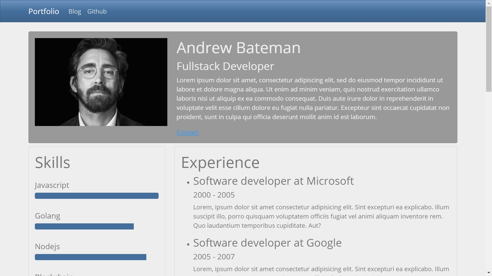

# :zap: Next Bootstrap Portfolio

* A Next.js app to show a person's portfolio using Bootswatch styles.
* **Note:** to open web links in a new window use: _ctrl+click on link_


## :page_facing_up: Table of contents

* [:zap: Next Bootstrap Portfolio](#zap-next-bootstrap-portfolio)
  * [:page_facing_up: Table of contents](#page_facing_up-table-of-contents)
  * [:books: General Info](#books-general-info)
  * [:camera: Screenshots](#camera-screenshots)
  * [:signal_strength: Technologies](#signal_strength-technologies)
  * [:floppy_disk: Setup](#floppy_disk-setup)
  * [:computer: Code Examples](#computer-code-examples)
  * [:clipboard: Status & To-Do List](#clipboard-status--to-do-list)
  * [:clap: Inspiration](#clap-inspiration)
  * [:file_folder: License](#file_folder-license)
  * [:envelope: Contact](#envelope-contact)

## :books: General Info

* Displays my portfolio info.
* Bootstrap [navbar](https://getbootstrap.com/docs/4.0/components/navbar/), [progress bar](https://getbootstrap.com/docs/4.0/components/progress/) used
* [Vercel Next.js](https://nextjs.org/) is for server-rendered react apps. It has automatic code splitting, simple page-based routing, built-in CSS support and hot reloading. Every component file in the pages folder is treated as a page.
* [Next Custom `Document`](https://nextjs.org/docs/advanced-features/custom-document)

## :camera: Screenshots

.

## :signal_strength: Technologies

* [Node.js v14](https://nodejs.org/) javascript runtime using the [Chrome V8 engine](https://v8.dev/).
* [React v17](https://reactjs.org/) Javascript library.
* [Next v10](https://nextjs.org/) minimalist framework for rendering react apps on the server.
* [Bootstrap v5](https://getbootstrap.com/)
* [Bootswatch v5](https://bootswatch.com/) theme
* [NProgress bars v0.2.0](https://www.npmjs.com/package/nprogress), requires nprogress.css, imported in `_document.js`
* [Classnames v2](https://www.npmjs.com/package/classnames) JavaScript utility for conditionally joining classNames together.

## :floppy_disk: Setup

* `npm run dev` runs the app in the development mode. Open [http://localhost:3000](http://localhost:3000) to view it in the browser.

## :computer: Code Examples

* `Layout.js` effects to handle navigation

```javascript
	useEffect(() => {
    const handleRouteChange = (url) => {
      NProgress.start();
    }

		router.events.on("routeChangeStart", handleRouteChange);
		router.events.on("routeChangeComplete", () => NProgress.done());
		router.events.on("routeChangeError", () => NProgress.done());

		return () => {
			router.events.off("routeChangeStart", handleRouteChange);
		};
	}, []);
```

## :clipboard: Status & To-Do List

* Status: Working
* To-Do: improve styling, update data, fix menu toggle if needed,

## :clap: Inspiration

* [Fazt code: Nextjs Portafolio Simple | Ejemplo Práctico de Next.js](https://www.youtube.com/watch?v=Ywj6YGgE5RI) in Spanish
* [Pagepro: PROS AND CONS OF NEXTJS IN 2021](https://pagepro.co/blog/pros-and-cons-of-nextjs/)

## :file_folder: License

* This project is licensed under the terms of the MIT license.

## :envelope: Contact

* Repo created by [ABateman](https://github.com/AndrewJBateman), email: gomezbateman@yahoo.com
